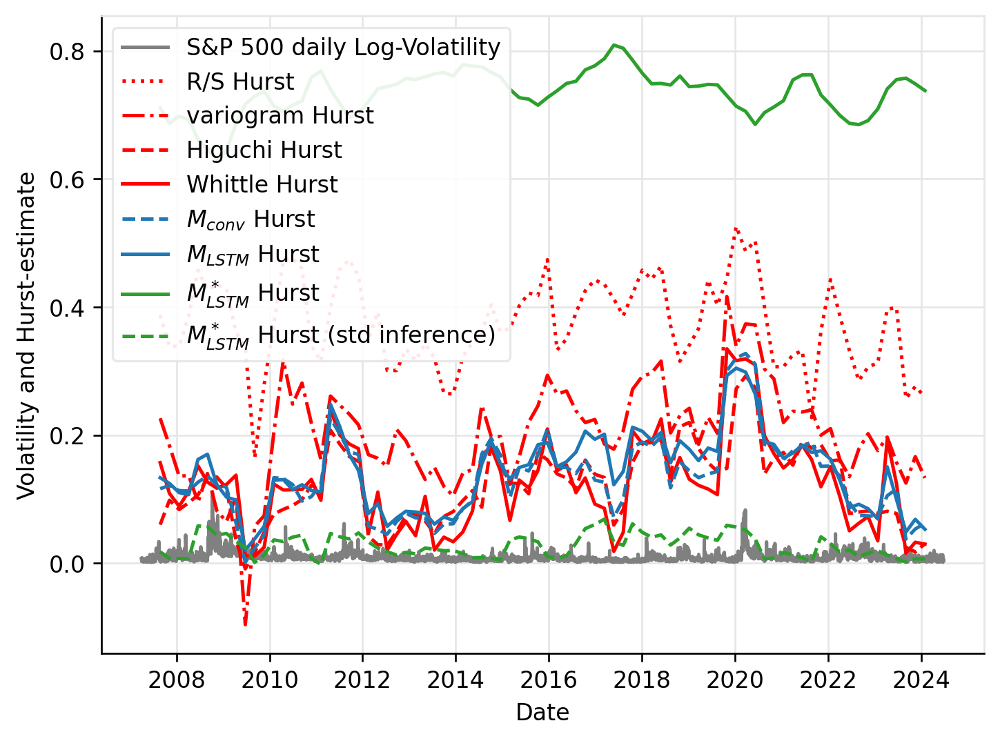

# Parameter Estimation of Long Memory Stochastic Processes with Deep Neural Networks

This repository contains the code for the [ECAI2024 paper](https://ebooks.iospress.nl/doi/10.3233/FAIA240784) _Parameter Estimation of Long Memory Stochastic Processes with Deep Neural Networks_.
An extended version with appendix can be found on [arXiv](https://arxiv.org/abs/2410.03776).

## Introduction

We introduce a pure deep neural network-based methodology for the estimation of long memory parameters associated with time series models, emphasizing on long-range dependence. Such parameters, notably the Hurst exponent, play an essential role in defining the long-range dependence, roughness, and self-similarity of stochastic processes. We harness efficient process generators to provide high-quality synthetic training data, enabling the training of _scale-invariant_ 1D Convolutional Neural Networks (CNNs) and Long Short-Term Memory (LSTM) models. Our approach is pivotal in diverse domains such as finance, physics, and engineering, where rapid and precise estimation of these parameters is crucial.

<p align="left">
  
</p>

Hurst-estimates for the daily S&P 500 log-volatility, calculated from 15-minute log-returns. Estimates use 252-day (one year) sliding windows with 189-day overlaps.
The results provided by our approach are shown in blue.
We include the estimates (shown in green) produced by $M_{\text{LSTM}}^\ast$ which is not scale and drift invariant. A version $M_{\text{LSTM}}^\ast$ is also shown, where we the input standardized before inference.

## Table of Contents
- [Introduction](#introduction)
- [Getting Started](#getting-started)
    - [Prerequisites](#prerequisites)
    - [Installation](#installation)
- [Training](#training)
- [Inference](#inference)
- [Known Issues](#known-issues)
- [License](#license)
- [How to Cite](#how-to-cite)
- [Acknowledgements](#acknowledgements)
---

## Getting Started

### Prerequisites

* OPTIONAL: Neptune.ai account

### Installation

1. Clone the repository:
   ```sh
   git clone <repo_URL>
   ```

2. Navigate to the project directory:
   ```sh
   cd LMSParEst
   ```

3. Install the required packages:

   * **Option a: using conda**

      First, create the conda environment:
      ```sh
      conda env create
      ```
      Activate the environment:
      ```sh
      conda activate LMSParEst
      ```
   * **Option b: using pip**
      ```sh
      pip install -r requirements.txt
      ```

4. OPTIONAL: Neptune.ai

   * **Option a: Set up neptune.ai api token and project name**
   
      Put the neptune.ai project name and your api token in the `neptune_cfg.yaml` file.
      For the api token you can also use the `NEPTUNE_API_TOKEN` env. var.
      ```sh
      export NEPTUNE_API_TOKEN="YOUR_API_TOKEN"
      ```

   * **Option b: do nothing**

      Use the technical user already provided in `neptune_cfg.yaml`, in this case no steps are needed.

   * **Option c: bypass logging to neptune.ai entirely**

      Edit `neptune_cfg.yaml`, write:
      ```yaml
      NEPTUNE_API_TOKEN: null
      ```
      this will disable neptune.ai logging.
   
## Training

```sh
   CUDA_VISIBLE_DEVICES=0 python main_trainer.py -c configs/<config_name>.yaml
```

E.g.

```sh
   CUDA_VISIBLE_DEVICES=0 python main_trainer.py -c configs/FBM/save_models_n/800.yaml
```

You can specify the save destination in the `train_params/checkpoint_save_path` field of the config file.

## Inference

Using `inference.py` we can estimate the parameters of our own sequences from a `.csv`,
```tsv
0.14667,0.0,0.23876,0.22432,...,-0.73709
0.36946,0.0,0.07471,0.07089,...,-2.16548
...
0.42360,0.0,-0.06837,-0.06133,...,-1.33228
```
`.tsv`,
```tsv
0.14667  0.0   0.23876  0.22432  ... -0.73709
0.36946  0.0   0.07471  0.07089  ... -2.16548
...
0.42360  0.0   -0.06837 -0.06133 ... -1.33228
```
or `.json`
```tsv
[
   [0.14667, 0.0, 0.23876, 0.22432, ..., -0.73709],
   [0.36946, 0.0, 0.07471, 0.07089, ..., -2.16548],
   ...,
   [0.42360, 0.0, -0.06837, -0.06133, ..., -1.33228]
]
```
format.

The script can either run in pure inference or in evaluation mode: if the first number in each row of the input data contains the target parameter value and the `targetcolumn` flag is set, the loss metrics and evaluation plots will be created.
Be aware, that all rows will be truncated to the minimum sequence length in the input data. 

The options for the script are the following:
```sh
usage: inference.py [-h] -i INPUTFILE -o OUTPUTFILE [-t] [-s SERIESTYPE] [-m MODELTYPE] [-w WEIGHTSFILE] [-b BATCHSIZE] [-c CONFIGFILE]

optional arguments:
  -h, --help            show this help message and exit
  -t, --targetcolumn    If the flag is present, column 0 of the input file is expected to contain the already known values of the target parameter. (default: False)
  -s SERIESTYPE, --seriestype SERIESTYPE
                        Type of the predicted sequence. Options: 'fBm' (Hurst), 'fOU' (Hurst) and 'ARFIMA' (d). (default: fBm)
  -m MODELTYPE, --modeltype MODELTYPE
                        Type of the prediction model. Options: 'LSTM' and 'conv1D'. (default: LSTM)
  -w WEIGHTSFILE, --weightsfile WEIGHTSFILE
                        File path of the trained model weights. If desired to change the default which comes from the model and sequence selection. (default: None)
  -b BATCHSIZE, --batchsize BATCHSIZE
                        Inference batch size. (default: 32)

required arguments:
  -i INPUTFILE, --inputfile INPUTFILE
                        File path of the input '.csv', '.tsv' or '.json' file. (default: None)
  -o OUTPUTFILE, --outputfile OUTPUTFILE
                        File path of the '.csv', '.tsv' or '.json' file the outputs will be saved in. (default: None)
```

Example usage:

```sh
   CUDA_VISIBLE_DEVICES=0 python python inference.py -i inference_input_data/fBm_tst_100_n-1600.csv -o inference_output_data/fBm_tst_100_n-1600.tsv -t
```

Alternatively, you can also use `main_trainer.py` directly using a config file of your choosing:

```sh
   CUDA_VISIBLE_DEVICES=0 python python main_trainer.py -c configs/Integrity_tests/Integrity_test_fBm.yaml
```

## Known Issues
This issue was happening in our testing environment.
If getting the following error:
```sh
ImportError: /lib/x86_64-linux-gnu/libstdc++.so.6: version `GLIBCXX_3.4.29' not found ...
```
The following might fix it for Miniconda:
```sh
export LD_LIBRARY_PATH=/home/<USERNAME>/miniconda3/lib
```
And for Anaconda:
```sh
export LD_LIBRARY_PATH=/home/<USERNAME>/anaconda3/envs/LMSParEst/lib
```

## License
Copyright 2024 Bálint Csanády, Lóránt Nagy, Dániel Boros, Iván Ivkovic, Dávid Kovács, Dalma Tóth-Lakits, László Márkus, András Lukács

Licensed under the Apache License, Version 2.0 (the "License");
you may not use this file except in compliance with the License.
You may obtain a copy of the License at

   http://www.apache.org/licenses/LICENSE-2.0

Unless required by applicable law or agreed to in writing, software
distributed under the License is distributed on an "AS IS" BASIS,
WITHOUT WARRANTIES OR CONDITIONS OF ANY KIND, either express or implied.
See the License for the specific language governing permissions and
limitations under the License.

## How to Cite
```bibtex
@incollection{LMSParEst2024csanady,
  title={Parameter Estimation of Long Memory Stochastic Processes with Deep Neural Networks},
  author={Csan{\'a}dy, B{\'a}lint and Nagy, L{\'o}r{\'a}nt and Boros, D{\'a}niel and Ivkovic, Iv{\'a}n and Kov{\'a}cs, D{\'a}vid and T{\'o}th-Lakits, Dalma and M{\'a}rkus, L{\'a}szl{\'o} and Luk{\'a}cs, Andr{\'a}s},
  booktitle={ECAI 2024},
  pages={2548--2555},
  year={2024},
  publisher={IOS Press}
}
```

## Acknowledgements
The research was supported by the National Research, Development and Innovation Office within the framework of the Thematic Excellence Program 2021 - National Research Sub programme: “Artificial intelligence, large networks, data security: mathematical foundation and applications" and the Artificial Intelligence National Laboratory Program (MILAB), and the Hungarian National Excellence Grant 2018-1.2.1-NKP-00008.
